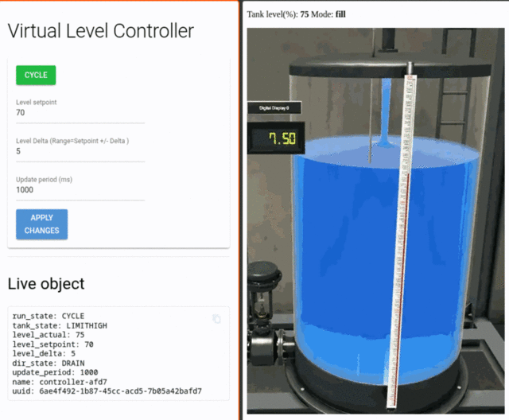

# virtual_watertank
A simple simulated watertank and level controller that run in containers, with web-based display. 

author: Rich Moore - rmoorewrs@gmail.com



## Requirements
- docker and docker-compose
- preferably membership in the docker group so you can run docker without root
```
sudo usermod -aG docker <your_username>
newgrp docker
docker run --rm hello-world # this should work without sudo
```

By default the project creates two containers and they're started by docker-compose. So that's really it unless you intend to run the applications locally, and then you'll need more packages: 
- python 3.x
- python venv
- curl

>See the Optional section below on how to run the apps locally. 


>NOTE: modern browsers seem to take it upon themselves to arbitrarily block some ports while accepting others. For example, using ports `5050/5051` for the 2 containers seems to work perfectly fine, but ports `5060/5061` are blocked at this time. Some browsers gave a helpful error, others quietly refused to connect, so be warned if you change ports to unknown ranges.  

## Instructions

1) Clone this repo

```
git clone https://github.com/rmoorewrs/virtual_watertank.git
```

2) Build the containers
```
cd virtual_watertank
./build_containers.sh
```

3) Run the tank container

```
cd virtual_watertank
docker compose up 
# or
docker-compose up
```

4) Observe the Tank in a browser

Open two browser windows: 
- http://localhost:5050   # this is the virtual watertank display
- http://localhost:5051   # this is the virtual level controller UI

5) Stop the Tank
```
cd virtual_watertank
docker compose down 
# or
docker-compose down
```

---

### Running Locally (not in container): 
6) set Up Virtual Environment
If you want to run the python applications locally then set up a virtual environment:
```
cd  # into top level of git repo
mkdir .venv
python3 venv .venv
./venv/bin/activate
pip install -r requirements.txt
```
When you want to exit the virtual environment, just type `deactivate`

7) Copy and edit the config.yaml file
```
cp <git_repo_directory>/config/local/config.yaml .
```
Optional: Edit the ports to work for your setup

8) Run the Tank first
From the top level git directory
```
source .venv/bin/activate
python3 src/virtual_watertank/virtual_watertank.py --config ./config.yaml
```
Open browser to the port specified in `config/local/config.yaml` i.e. `5050`

9) Run the Level Controller
Open another shell and cd into the top level of the git repo
```
source .venv/bin/activate
python3 src/virtual_levelcontroller/virtual_controller.py --config ./config.yaml
```


### Changing Parameters in the `config.yaml` file
When running 


### Test the API using curl

#### Get tank level:

```
curl http://localhost:5050/level
```
Expected Response (example):
```
{
    "level": 26
}
```


#### Set tank level (force level):

```
curl -X POST http://localhost:5050/level -H "Content-Type: application/json" -d '{"level": 75}'
```
Expected Response (example):
```
{
    "level": 75
}
```
#### Drain water from the tank:

Example: drain 1% of the water
```
 curl -X POST http://localhost:5050/drain -H "Content-Type: application/json" -d '{"delta_level": 1}'
```
Expected Response (example):
```
{
    "level": 73,
    "mode": "drain"
}
```
#### Add water to the tank:

Example: add 1% of tank's capacity
```
 curl -X POST http://localhost:5050/fill -H "Content-Type: application/json" -d '{"delta_level": 1}'
```
Expected Response (example):
```
{
    "level": 74,
    "mode": "fill"
}
```

#### Get an image showing the current tank level:
```
curl http://localhost:5050/image --output /tmp/current_tank_level.webp
```
